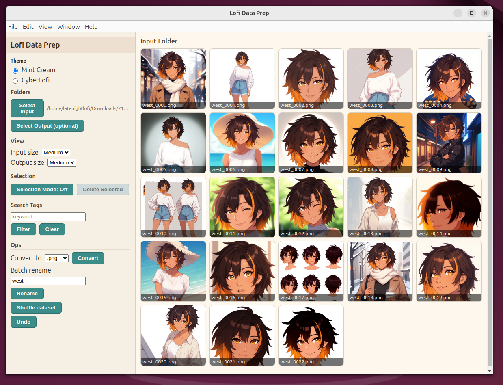
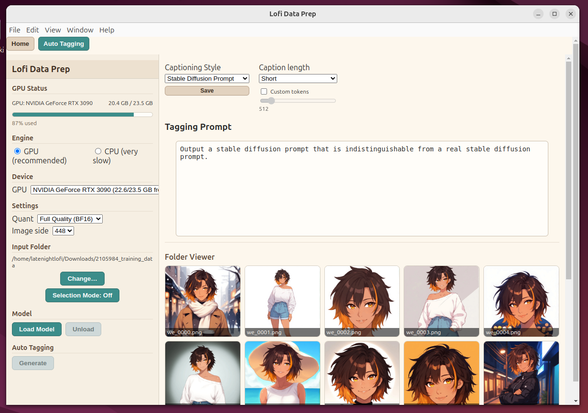

# Lofi LoRA Data Prep

A desktop tool (Electron + Python sidecar) for curating LoRA datasets: rename, shuffle, convert, and tag images with automated captioning.

## Features

* GUI for dataset management (rename, shuffle, convert formats)
* Automated image captioning via JoyCaption (LLaVA-based)
* Tag editing and prompt customization
* Works with CPU or NVIDIA GPU (INT8, NF4, BF16 quantization)
* Built-in GPU/VRAM monitor

## Requirements

* Python 3.10+
* Node.js + npm (from [https://nodejs.org](https://nodejs.org))
* NVIDIA GPU (optional for acceleration — CPU mode works everywhere)


## Attibutions 
This project uses JoyCaption for automatic image captioning. https://github.com/fpgaminer/joycaption
JoyCaption is licensed under the Apache License 2.0 https://github.com/fpgaminer/joycaption/blob/main/LICENSE

## Quickstart

### Windows

1. Clone or download this repo

   ```bash
   git clone https://github.com/JustLateNightAI/Lofi-Lora-Data-Prep.git
   cd Lofi-Lora-Data-Prep
   ```
2. Run setup

   * Double-click `setup.bat`
   * Creates a Python virtualenv under `sidecar\\`
   * Installs Python + npm dependencies
   * Prompts you to pick CPU or CUDA PyTorch
3. Run the app

   * Double-click `start.bat`
   * Electron launches and automatically spawns the sidecar

### Linux

1. Clone the repo

   ```bash
   git clone https://github.com/JustLateNightAI/Lofi-Lora-Data-Prep.git
   cd Lofi-Lora-Data-Prep
   ```
2. Set up Python sidecar

   ```bash
   cd sidecar
   python3 -m venv .venv
   source .venv/bin/activate
   pip install --upgrade pip
   pip install -r requirements.txt
   # Optional: install torch with CUDA (NVIDIA only)
   # pip install --index-url https://download.pytorch.org/whl/cu124 torch torchvision torchaudio
   cd ..
   ```
3. Set up Electron app

   ```bash
   npm install
   ```
4. Run the app

   ```bash
   # Make sure your venv is active so the sidecar uses it
   source sidecar/.venv/bin/activate
   npm run dev
   ```

## ⚙ Notes

* No NVIDIA? Choose CPU during setup (or install CPU Torch on Linux).
* If CUDA install fails on Windows, update NVIDIA drivers or rerun setup and choose CPU.
* Logs stay open in the console for debugging.

## Screenshots




## License

Creative Commons BY-NC 4.0 License
