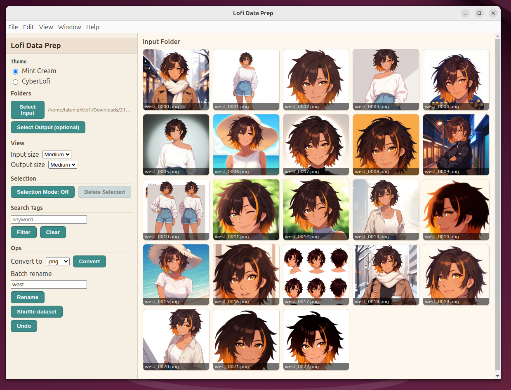

# Lofi Lora Data Prep

A cross-platform Electron app for curating LoRA training datasets.
Built for Linux and Windows, God help you if your on Mac (in theory it should work on mac, but im not supporting mac)

## Features
- Input/output folder selection
- Thumbnail grid viewer
- Image format conversion (PNG, JPG, WEBP)
- Dataset shuffle & batch renaming
- Tag file editing with live preview
- Search tags & selection mode
- Undo operations

## planned Features
- Image health checker (checks for artifacting, high noise, blurry images, duplicates, small imgs, ect)
- Image bucketing for SD1.5, SDXL, Flux, and custom to optimize image sizes for faster and cleaner training
- batch tag editing to easily add trigger words to all images
- somekind of auto image tagging and maybe api based tagging support
  


## Screenshots




## Installation
```bash
git clone https://github.com/JustLateNightAI/Lofi-Lora-Data-Prep.git
cd Lofi-Lora-Data-Prep
npm install
npm run dev
